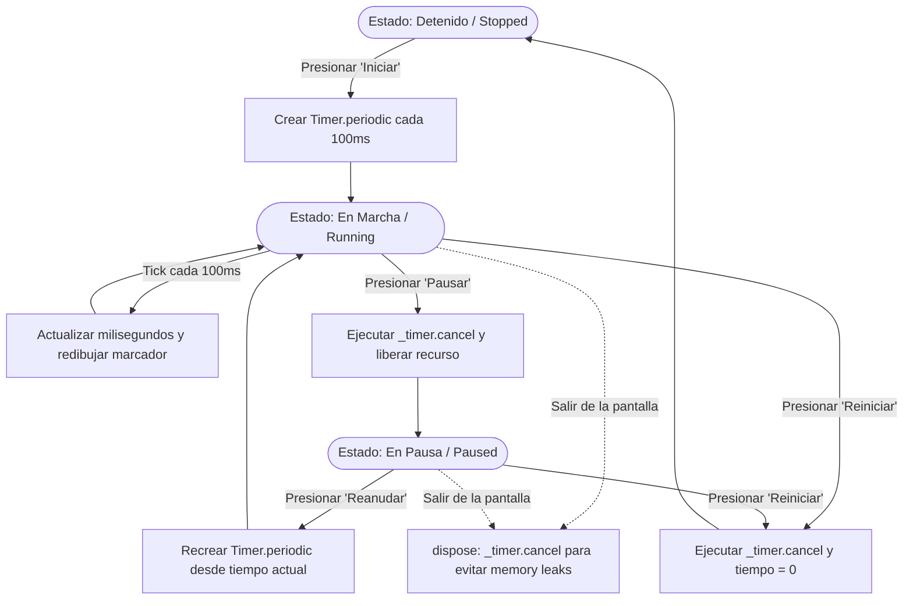
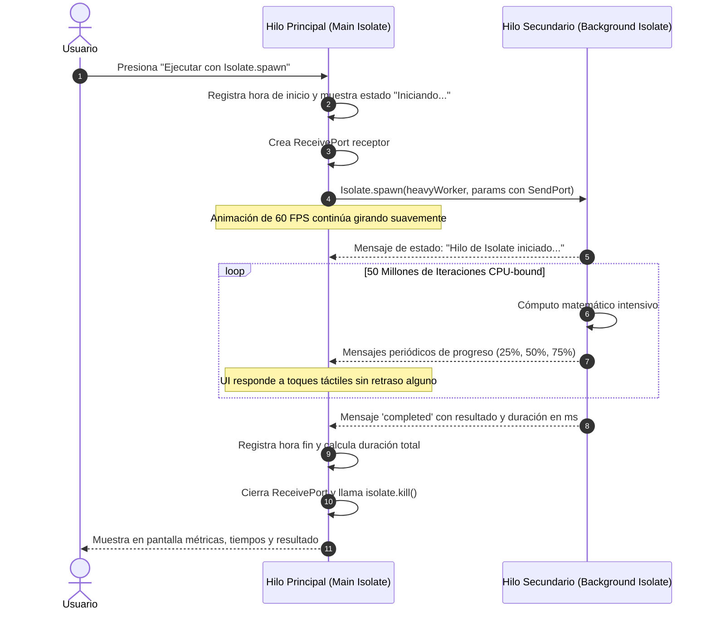

# Taller de Segundo Plano: Asincronía, Timer e Isolates en Flutter

**Asignatura:** Electiva Profesional I - Proyecto Móviles  
**Estudiante:** Brahian Tenorio  
**Repositorio GitHub:** [https://github.com/brahiantenorio/proyectoMoviles](https://github.com/brahiantenorio/proyectoMoviles)  
**Ramas del Proyecto:** `main`, `dev`, `feature/taller_segundo_plano` (Siguiendo GitFlow)

---

## 📌 1. Fundamentos Teóricos: ¿Cuándo usar cada mecanismo?

Dart es un lenguaje de ejecución basada en un único hilo de ejecución (**Single-Threaded**) impulsado por un bucle de eventos (**Event Loop**). Para no bloquear la interfaz gráfica (renderizada a 60 o 120 FPS), Dart ofrece distintos mecanismos según la naturaleza del problema:

| Mecanismo | Naturaleza de la Tarea | Dónde se ejecuta | ¿Bloquea la UI si se usa mal? | Cuándo Utilizarlo |
| :--- | :--- | :--- | :--- | :--- |
| **`Future` / `async` / `await`** | **I/O-Bound** (Espera de red, lecturas en disco, queries a base de datos). | En el mismo hilo (Event Loop de Dart). | No congela la UI en esperas I/O, pero **sí** congela la UI si adentro se hace un bucle pesado de CPU. | Cuando la tarea implica esperar una respuesta externa sin consumir ciclos masivos de CPU (ej. llamadas a APIs REST, Firebase, SQLite). |
| **`Timer` (`Timer.periodic`)** | **Temporal / Basada en tiempo** (retrasos, repeticiones periódicas, cronómetros). | En el Event Loop mediante la cola de eventos de temporizador. | No congela la UI, pero si no se cancela (`timer.cancel()`) genera **fugas de memoria** (memory leaks). | Cuando se requiere ejecutar código después de un retardo (`Timer`) o en intervalos regulares (`Timer.periodic`), como relojes, cronómetros, auto-refresco o debounce. |
| **`Isolate` (`Isolate.spawn`)** | **CPU-Bound** (Cómputo pesado que consume el 100% de un núcleo de procesador). | En un hilo nativo del SO independiente con su propia memoria heap. | **Previene el congelamiento de la UI**, ya que el cálculo se traslada a otro núcleo de CPU. | Cuando hay cálculos matemáticos masivos, compresión/encriptación, procesamiento de imágenes o audio, o parseo de JSONs gigantescos (+50MB). |

### 🔍 Explicación Detallada:
1. **`Future` con `async/await`**:
   - `Future` representa un valor o error que estará disponible en algún momento en el futuro.
   - `async` y `await` ofrecen azúcar sintáctica para escribir código asíncrono con aspecto secuencial y legible, evitando el "callback hell" (`.then()`).
   - Durante el `await`, Dart suspende la ejecución de esa función y continúa atendiendo eventos de la UI (toques, animaciones).

2. **`Timer`**:
   - Gestiona eventos basados en tiempo dentro del Event Loop de Dart.
   - En vistas dinámicas (`StatefulWidget`), es **estrictamente indispensable cancelar el Timer** tanto al pausar como en el método `dispose()`. De lo contrario, el temporizador seguirá ejecutándose en segundo plano aunque el usuario haya abandonado la pantalla, reteniendo referencias a widgets destruidos.

3. **`Isolate` (`Isolate.spawn`)**:
   - A diferencia de los hilos tradicionales de Java o C++, los Isolates de Dart **no comparten memoria** (de ahí el nombre *isolate*). Cada Isolate tiene su propio recolector de basura (GC) y su propio Event Loop.
   - La comunicación entre el hilo principal y el Isolate secundario se realiza mediante el paso de mensajes seguros usando `ReceivePort` y `SendPort`.

---

## 📱 2. Arquitectura y Pantallas de la Aplicación

La aplicación se construyó con arquitectura modular y Material 3:

```text
lib/
├── main.dart                          # Punto de entrada y barra de navegación NavigationBar
├── screens/
│   ├── future_async_screen.dart       # Requisito 1: Petición simulada, estados UI y logs de consola
│   ├── timer_screen.dart              # Requisito 2: Cronómetro marcador digital y limpieza de recursos
│   ├── isolate_screen.dart            # Requisito 3: Cálculo intensivo con Isolate.spawn y métricas
│   └── taller1_screen.dart            # Historial intacto del Taller 1 previo
└── services/
    ├── mock_data_service.dart         # Servicio simulado con Future.delayed (2.5 s)
    └── heavy_computation_service.dart # Worker estático CPU-bound (50M de iteraciones)
```

---

## 🔄 3. Diagramas de Flujo de los Procesos

### ⏱️ Flujo del Cronómetro (Timer):



### 🧠 Flujo de Tarea Pesada en Isolate (CPU-Bound):



---

## 🚀 4. Guía de Ejecución Local

1. Clonar el repositorio:
   ```bash
   git clone https://github.com/brahiantenorio/proyectoMoviles.git
   cd proyectoMoviles
   ```
2. Cambiar a la rama de trabajo o dev:
   ```bash
   git checkout feature/taller_segundo_plano
   ```
3. Descargar dependencias:
   ```bash
   flutter pub get
   ```
4. Ejecutar la aplicación (Windows, Web o Android/Emulador):
   ```bash
   flutter run
   ```

---

## 📋 5. Flujo GitFlow Utilizado

1. **Rama de inicio:** `dev` (sincronizada con el repositorio base).
2. **Rama de característica:** `feature/taller_segundo_plano` creada a partir de `dev`.
3. **Commits atómicos realizados:**
   - `feat(future): implementar servicio simulado con Future.delayed y pantalla con async/await y estados`
   - `feat(timer): implementar cronometro interactivo con Timer, control de estados y limpieza de recursos`
   - `feat(isolate): implementar tarea pesada CPU-bound con Isolate.spawn y comunicacion por mensajes`
   - `feat(ui): integrar navegacion principal con tabs Material 3 y tests de integracion`
   - `docs: actualizar README con teoria de asincronia, diagramas y guia de evidencias`
4. **Pull Request e Integración:**
   - Pull Request desde `feature/taller_segundo_plano` hacia `dev`.
   - Merge hacia `dev`.
   - Integración final de cambios probados hacia `main`.
